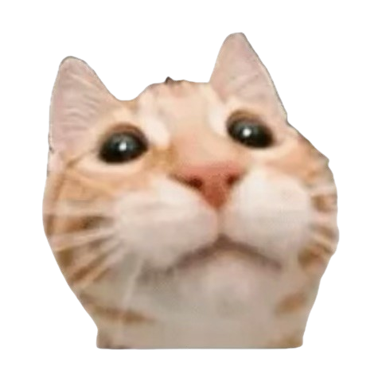

Hi, fancy seeing you here!

So glad you've stumbled across my site (voluntary or otherwise), and I hope you stick around with me and my journey into the world of cybersecurity. I've always had an interest in technology, as I've grown up playing video games and building computers. That curiosity fueled my desire to figure out how things worked and I soon became interested in the mysteries of technology around me. I'd rack my brain trying to understand things that were not yet understood. Little ol' me became invested in cryptographic stories such as [Cicada 3301](https://www.60out.com/blog/unsolved-mystery-cicada-3301-cypher) and [Kryptos](https://mathweb.ucsd.edu/~crypto/Projects/KarlWang/index.html) (can't go too in depth, or else I'd never finish writing).

Anyway, that all led me to further my academics at Santa Clara University, where I recently graduated with a B.S. in Computer Science and Engineering. Endured four strenuous years but I now own a neat piece of paper (as of writing it hasn't shipped, so I lied). I also have the paper holder, if that's any consolation.

During this time, I've had a lot of internal strife regarding my future and what career path I wanted to pursue. Over time, I've realized that my interests in security outweighed my education in software (though the latter gives me a great foundation). I'm grateful to have both drive and direction, which is the result of a whole lot of introspection.

But I digress.

I've wanted a personal site for a while, but was unsure if it would get any use. Seeing this as an opportunity to showcase some of the cool projects I'm working on, I figured it'd be a good of a time as ever.

Oh also it gives me a safe space to yap YIPPEE!

For now, my site serves as a small place for my blog, projects and other things I'd consider adding in the future. Rather than a portfolio, I'd like for this to be an extension of myself. I'd want it to learn, to grow, and to tell my stories along the way.

And if abstractionism isn't your cup of tea, this is my portfolio :D

I'm keeping the site intentionally simple. Part of that is practical, but part of it is also because I don't want to take away from the content.

Anywho, I've been rambling on for long enough, so thank you for reading and enjoy this happy cat!

